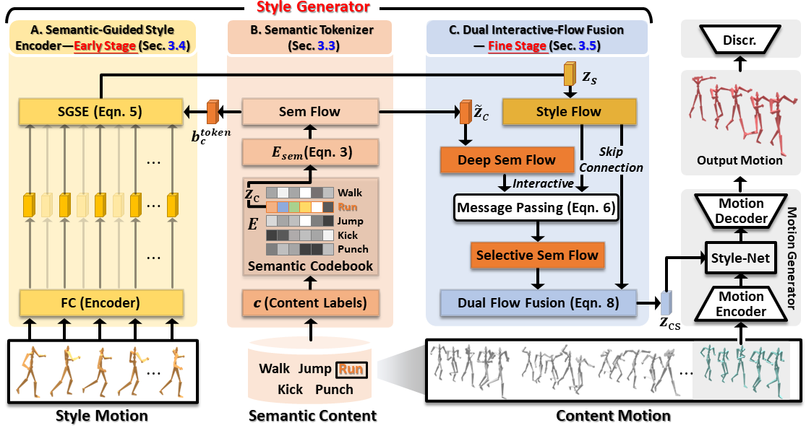

# FineStyle: Semantic-Aware Fine-Grained Motion Style Transfer with Dual Interactive-Flow Fusion

<p align="center"> <br></p>

> **Abstract:** We present FineStyle, a novel framework for motion style transfer that generates expressive human animations with specific styles for virtual reality and vision fields. It incorporates semantic awareness, which improves motion representation and allows for precise and stylish animation generation. Existing methods for motion style transfer have all failed to consider the semantic meaning behind the motion, resulting in limited controls over the generated human animations. To improve, FineStyle introduces a new cross-modality fusion module called Dual Interactive-Flow Fusion (DIFF). As the first attempt, DIFF integrates motion style features and semantic flows, producing semantic-aware style codes for fine-grained motion style transfer. FineStyle uses an innovative two-stage semantic guidance approach that leverages semantic clues to enhance the discriminative power of both semantic and style features. At an early stage, a semantic-guided encoder introduces distinct semantic clues into the style flow. Then, at a fine stage, both flows are further fused interactively, selecting the matched and critical clues from both flows. Extensive experiments demonstrate that FineStyle outperforms state-of-the-art methods in visual quality and controllability. By considering the semantic meaning behind motion style patterns, FineStyle allows for more precise control over motion styles.
## Requirements

- Pytorch
- scipy
- pyyaml
- tqdm
- tensorboardX
- sklearn
- tikzplotlib
- scikit-learn


## Installation
Clone this repository and create environment:

```bash
git clone https://github.com/XingliangJin/Fine-Style.git
cd Fine-Style
conda create -n Fine-Style python=3.8
conda activate Fine-Style
```
First, install PyTorch >= 1.7.1 from [PyTorch](https://pytorch.org/). \
Then install the other dependencies in Requirements. 


## Quick start
Run the following commands:
```bash
python test.py --content_src data/xia_test/neutral_01_000.bvh \   # input content bvh file
               --style_src data/xia_test/childlike_01_000.bvh \     # input style bvh file
               --output_dir output                            # output directory
```

If you want to generate more results in one command, run:
```bash
sh demo.sh
```

## Train Fine-Style
Simply run the following command:
```bash
python train.py --name experiment_name
```
You can change more settings of training in config.py.

If you want to generate processed training data from the original dataset yourself, you can first download the dataset from [mocap_xia](https://drive.google.com/file/d/16vKR9-OWleMuIIJ5G5iD3sqHF6MGyLEr/view?usp=drive_link). Then unzip it in ./data floder and run the following command:
```bash
cd data_proc
sh gen_dataset.sh
```
## Acknowledgements
Our code is mostly taken from the following repositories: \
[A Deep Learning Framework For Character Motion Synthesis and Editing](http://theorangeduck.com/page/deep-learning-framework-character-motion-synthesis-and-editing). \
[Unpaired Motion Style Transfer from Video to Animation](https://github.com/DeepMotionEditing/deep-motion-editing). \
We sincerely thank these authors for their awesome work.
